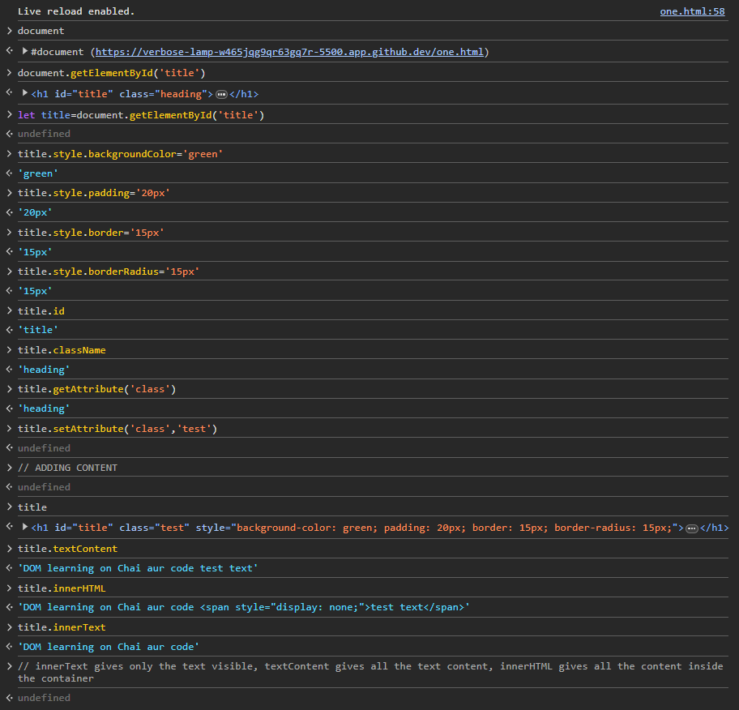
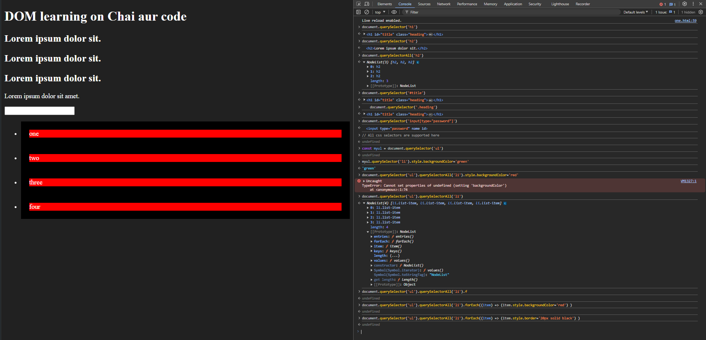
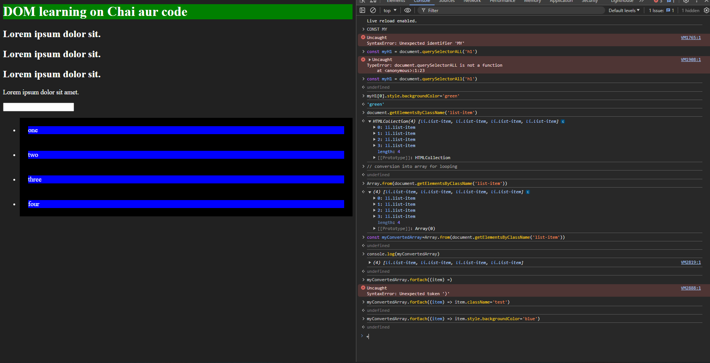

## DOM OF BROWSER WINDOW DIAGRAM

window
│
├── document
│   ├── html
│   │   ├── head
│   │   │   ├── title
│   │   │   └── meta
│   │   └── body
│   │       ├── header
│   │       ├── main
│   │       │   ├── section
│   │       │   │   ├── h1
│   │       │   │   ├── p
│   │       │   │   └── a
│   │       │   └── article
│   │       │       ├── h2
│   │       │       └── p
│   │       └── footer
│   ├── getElementById()
│   ├── createElement()
│   └── querySelector()
│
├── location
│   ├── href
│   ├── hostname
│   ├── pathname
│   └── search
│
├── history
│   ├── back()
│   ├── forward()
│   └── go()
│
├── navigator
│   ├── userAgent
│   ├── language
│   ├── online
│   └── geolocation
│
├── screen
│   ├── width
│   ├── height
│   ├── availWidth
│   └── availHeight
│
├── console
│   ├── log()
│   ├── warn()
│   └── error()
│
├── localStorage
│   ├── setItem()
│   ├── getItem()
│   └── removeItem()
│
├── sessionStorage
│   ├── setItem()
│   ├── getItem()
│   └── removeItem()
│
├── setTimeout()
├── setInterval()
├── clearTimeout()
├── clearInterval()
│
├── alert()
├── confirm()
├── prompt()
│
├── fetch()
│
└── Event Handling
    ├── addEventListener()
    └── removeEventListener()

## DOM MANIPULATION IN CONSOLE

